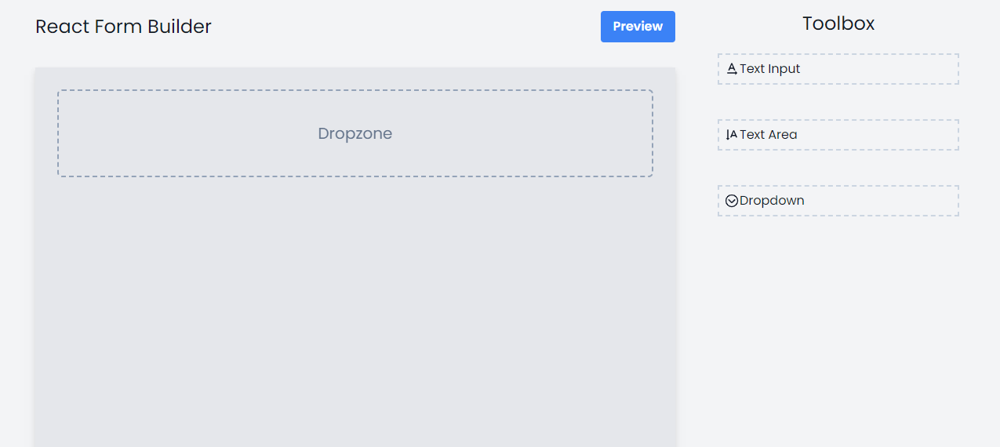

[PATİKA PROFILE URL](https://app.patika.dev/fatihdelice)

# Form Builder
Sürükle bırak yöntemiyle form oluşturma uygulaması geliştirmeniz gerekiyor.

## Gereksinimler

- [ ] Toolbox'da listeleyeceğiniz Text Input, Textarea ve Dropdown sürüklenerek content alanına bırakılabilmelidir.
- [ ] Content alanındaki her bir bileşen düzenlenebilir olmalıdır.
- [ ] Content alanındaki her bir bileşen silinebilir.
- [ ] "Preview Form" butonuna basılarak formun son hali önizlenebilmelidir.

## Screenshot
